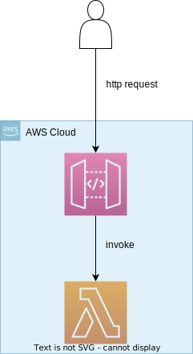

# hello-world

这是一个最简单的AWS SAM项目，通过使用AWS Lambda计算平台，实现一个http api接口；当用户请求api时，http
request先到api-gateway，然后api-gateway用这个http request event触发lambda执行，lambda对该event处理后将结果返回给用户。

**Arch**

# reference

- [安装AWS SAM并部署第一个AWS Lambda服务[AWS Lambda教程-AWS SAM系列] ](https://juejin.cn/post/7259274760027406391)
- [AWS SAM 本地调试[AWS Lambda教程-AWS SAM系列]](https://juejin.cn/post/7259687894696198203)
- [AWS SAM项目结构和自定义配置[AWS Lambda教程-AWS SAM系列] ](https://juejin.cn/post/7260024054065938490)
- [AWS SAM Doc](https://docs.aws.amazon.com/serverless-application-model/index.html)