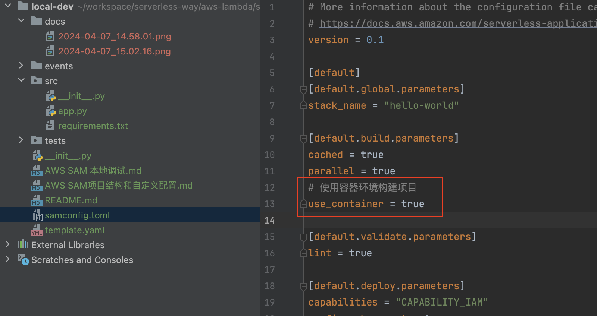

# local-dev

对AWS SAM框架做自定义的设置

**调整AWS Lambda运行环境的CPU架构**

我们可以为在AWS Lambda 环境中的项目选择不同CPU架构，其中如果你可以做好ARM CPU适配的化，选用AWS Graviton
CPU驱动的ARM运行时会获得更好的性能和更低的计算成本

我们可以在[template.yaml](./template.yaml)中设置`Architectures`

**修改项目文件路径**

很多人希望自己定义自己代码的文件结构，比如更改源代码的目录名称为src，更改自己的函数入口的py文件名称、handler函数名称等。

我们可以在[template.yaml](./template.yaml)中进行同步的调整，只要[template.yaml](./template.yaml)的`CodeUri`和`Handler`
的具体设置和项目的实际结构相吻合即可。

**使用容器环境构建项目**
我们本地的开发电脑大部分是x86_64的cpu并预装Windows操作系统，但是云端的AWS
Lambda环境是Linux操作系统并可选x86_64或者arm64架构的cpu。代码在不同的环境中运行可能会出现不兼容的情况或者程序运行效率下降，为了解决这个问题，我们除了可以使用专用的CICD系统外，也可以在本地模拟实际的线上环境

我们可以在[samconfig.toml](./samconfig.toml)启用`use_container`
即可;但是请注意你必须在本地电脑安装好Docker环境,详情请看[Testing Lambda container images locally](https://docs.aws.amazon.com/lambda/latest/dg/images-test.html)

**sam部署项目时指定s3桶**
我们本地写好的项目需要发布到云端运行环境，sam会现在本地打包好本地并上传到S3。如果我们不指定S3桶，默认情况下每个新项目部署时会自动的尝试为我们创建一个S3桶，项目多了会导致S3桶过多以及S3桶名混乱难管理等问题。我们可以自定义S3桶并给出集中存放在这个S3桶的某个路径下。

我们可以在[samconfig.toml](./samconfig.toml)中的`default.deploy.parameters`添加如下的配置即可

**为lambda项目指定vpc子网和安全组**

默认情况下，我们部署的lambda是运行在AWS Lambda服务自身拥有的VPC内运行，不是客户拥有的某个VPC。当我们需要连接客户拥有的某个VPC里面的资源比如AWS
RDS
MySQL或者想为lambda做高级的网络管理，那么我们需要主动设置lambda运行在我们自己的某个vpc中、指定VPC中的某些私有子网并指定安全组。，详情请看[Connecting Lambda functions to your VPC]([Connecting Lambda functions to your VPC](https://docs.aws.amazon.com/lambda/latest/dg/foundation-networking.html#foundation-nw-connecting)
),具体的设置在[template.yaml](./template.yaml)中进行设置

如下图我为自己的lambda指定了3个私有子网，指定了安全组,我们可以在[template.yaml](./template.yaml)中设置`VpcConfig`

**为lambda指定iam role**

当部署和运行lambda时，我们需要确保lambda拥有了相应的权限，一般我们通过给lambda一个iam role并这个role赋予**最小特权**
的权限来实现，例如我们的lambda需要操作aws s3时就需要给lambda execution
role赋予相应的S3权限。详情请看[Lambda execution role](https://docs.aws.amazon.com/lambda/latest/dg/lambda-intro-execution-role.html)
。具体的设置在[template.yaml](./template.yaml)中进行设置

我们可以在[template.yaml](./template.yaml)中设置`Role`

# reference

- [AWS SAM 本地调试[AWS Lambda教程-AWS SAM系列]](https://juejin.cn/post/7259687894696198203)
- [AWS SAM项目结构和自定义配置[AWS Lambda教程-AWS SAM系列] ](https://juejin.cn/post/7260024054065938490)
- [AWS SAM Doc](https://docs.aws.amazon.com/serverless-application-model/index.html)